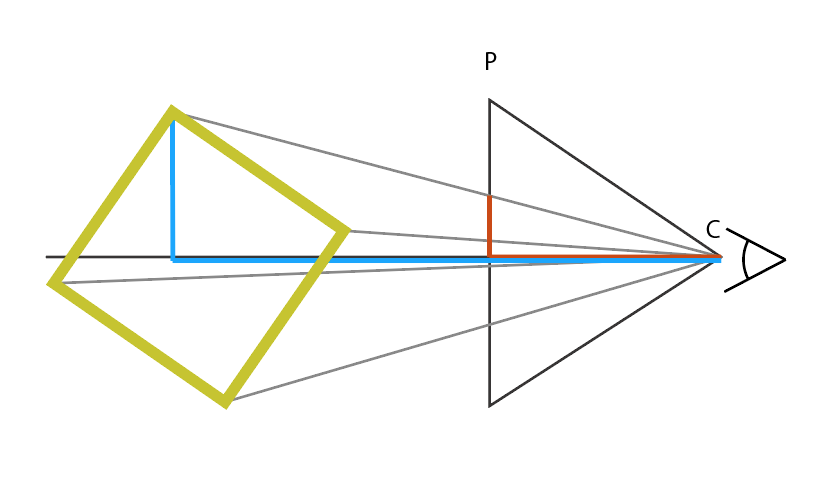

## Exercise 3: Rotation 3D-Cube
The goal of this exercise is to have a three-dimensional cube that is rotating around a specific rotation axis.
The orientation of this axis can be defined by the user.

### Creating the cube
Thanks to the time we invested into improving the abstraction in the previous exercises, modelling the 3D-Cube 
is now a very simple task. However, instead of defining the cube-model from scratch, we'll rely on primitive geometry we've already 
used in the previous exercises: the LineSegment. 
Since the _LineSegment-Model_ is still two-dimensional, we need to create a new Model for the third dimension. This involves
nothing more than copying our 2D-Model and changing it to use 3D-Coordinates. Note that this of course generates a lot of
duplicate code. So, the perfect solution would be to create an _AbstractLineSegment_ model and derive the two specific variations
from it. But for the sake of simplicity and time, let's not do this now.

Now, for the actual cube, we will just create eight vertices and connect them using our new _LineSegment3D_ model in the constructor:
```java

// [...]
this.edges = new ArrayList<>();

double halfEdge = size / 2.0f;

// Top square
Vector3D c1 = new Vector3D(x - halfEdge, y + halfEdge, z - halfEdge);
Vector3D c2 = new Vector3D(x + halfEdge, y + halfEdge, z - halfEdge);
Vector3D c3 = new Vector3D(x + halfEdge, y + halfEdge, z + halfEdge);
Vector3D c4 = new Vector3D(x - halfEdge, y + halfEdge, z + halfEdge);
this.addEdge(c1, c2, world);
this.addEdge(c2, c3, world);
this.addEdge(c3, c4, world);
this.addEdge(c4, c1, world);
// [...]
```

And accordingly, transforming and drawing the cube actually doesn't involve manipulating the cube-instance but rather its primitives:

```java
@Override
public void transform(Matrix newTransformationMatrix) {
    super.transform(newTransformationMatrix);
    for (LineSegment3D seg : this.edges) {
        seg.setTransformationMatrix(this.transformationMatrix);
    }
}

@Override
public void draw(GraphicsContext gc) {
    for (LineSegment3D edge : this.edges) {
        edge.draw(gc);
    }
}
```

### Introducing: The Camera
Up until now we've been using a very basic method to project 3D-space to a 2D-surface. All we did was removing
the z-coordinate from the 3D-Vectors and adding some additional offset to get our final screen coordinates. However, this
was only sufficient because we were operating in only two dimensions. Since for this exercise we're displaying
three dimensions, we need to be able to represent the third dimension on a surface.
For this purpose, we introduce a new model called _AbstractCamera_. Compared to our previous primitive implementation, a 
Camera inherits from _AbstractGeometry3D_ and thus can have a position in space. The Camera still implements the
_ifScreenProjectionStrategy_-interface and provides the _projectWorldToScreen_-method. For our previous exercises we will
just replace the _OrthogonalScreenProjectionStrategy_-class with the new _OrthogonalXYCamera_-model which still operates 
the same way.
However, for our 3D-exercise, we have to create a new model called _FixedPerspectiveCamera_. We will use a simplified 
projection mechanism. To understand how it works, let's look at the following picture:



The theorem of intersecting lines the relation between the real coordinates of the object (blue lines) is exactly the same as
the relation between the projected X/Y-coordinates and the distance to the projection surface (red lines). 
Thus, to calculate the 2D-coordinates we can simply use the following formula:

xObj = xObj * camDistance / zObj

This works quite well except for negative zObj, i.e. coordinates «behind» the camera. To account for this case, we use the
inverted positive value for zObj if it is negative, which means that the more zObj grows into the negative, the smaller the fraction of
1 / zObj becomes and with this, the greater the projected x-coordinate gets. 

The last thing we have to take care of is the location of the camera, so we have to subtract the position vector
 of the camera from the position vector of the object. So, the final projection code looks like this:

```java
@Override
public Vector2D projectWorldToScreen(Vector3D objVector) {

    Vector3D objPos = (Vector3D) objVector.subtract(this.getWorldVertex(0), new Vector3D(0, 0,0));

    Vector3D camProjDistance = this.getWorldVertex(1);
    double objZ = objPos.getValue(0, 2);
    double z_factor =  camProjDistance.getValue(0, 2) / ( objZ < 0 ? 1/Math.abs(objZ) : objZ);
    return new Vector2D(objPos.getValue(0, 0) * z_factor, objPos.getValue(0, 1) * z_factor);
}
```

### Rotating the Cube
In order to visualize the rotation axis, we use a new model _Axis3D_ which is simply a group of two polygons forming
an extruded cross. If we used a simple line, the perspective i.e. the orientation of the axis wouldn't be visible.
Since the _Axis3D_ model is derived from _AbstractGeometry3D_ it also keeps a _transformationMatrix_. We can use this matrix
 to apply the orientation of the rotation axis to the cube like so:
 
```java
private void applyTransformation() {

    TransformationMatrix3D raMatrix = this.rotationAxis.getTransformationMatrix();
    TransformationMatrix3D finalTransformation = (TransformationMatrix3D) raMatrix
            .multiply(userTransformationMatrix, TransformationMatrix3D.createIdentityMatrix())
            .multiply(raMatrix.getTransposed(), TransformationMatrix3D.createIdentityMatrix());


    for (ifCanvasDrawable geom : drawables) {
        ((AbstractGeometry3D) geom).transform(finalTransformation);
    }
    render();
}
```

Before the user transformation is applied, we rotate the cube the same as the axis is rotated and then perform the
user transformation. After that, we transform it back in the opposite direction the axis is rotated.

### Wrap up
These are the most significant steps for this exercise. The animation itself is a mere repetition of transformations
 in a separate thread. 
 
 ```java
 [...]
this.animThread = new AnimationTimer() {

    @Override
    public void handle(long now) {
        that.applyTransformation();
            try {
                Thread.sleep(ANIM_STEP_INTERVAL_MS);
            } catch (InterruptedException e) {
                Thread.currentThread().interrupt();
            }
    }
};
this.animThread.start();
[...]
```