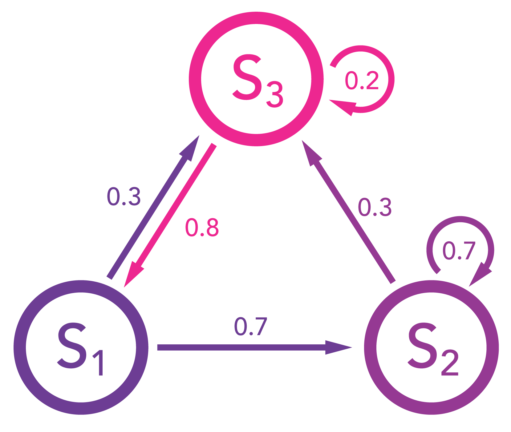

## Exercise 4: Page Rank Algorithm

### Introduction
One of the most vital concepts behind how Google ranks all the indexed websites is the so called «Page Rank Algorithm». 
First introduced and patented by Larry Page in 1998 [^1] this algorithm describes a method to assign a weight to every
page in the index depending on how many other pages link to that page and on the weight these pages have themselves.
In this article we'll cover the mechanics of the algorithm itself and some mathematical basics on which the algorithm relies on, such as the Markov-Chain and the Eigenvalue-problem.

### Eigenvalue and Eigenvectors
In order to better understand the mathematics behind, we need to cover a topic called «Eigenvalue/Eigenvector» first. 
Let's assume we have the following Matrix:

$$ 

A=\begin{bmatrix}1 & 2 \\ 3 & 4\end{bmatrix}

$$

Now, if we have a vector $$\vec{x}$$ which is not the null vector, then the following equation with the Eigenvalue 
represented by $$\lambda$$ must be valid:
  
$$

A\vec{x}=\lambda\vec{x}

$$

What is this good for? Well, imagine you have a square matrix of a million columns by a million rows – have fun 
multiplying this monster with a vector. The neat thing about Eigenvalues is that you can represent the whole Matrix with
just one scalar. And then do the multiplication with its corresponding Eigenvector instead. 

### The Markov-Chain
Equally essential to the understanding of the Page Rank Algorithm is the so-called «Markov-Chain». It describes a 
state-transformation matrix which holds the weights of an adjacency graph. And every weight represents the probability
with which the described system will change its current state to another. Let's have a look at the following image to
get a clearer picture:

{:width="80%"}

This diagram shows three stages $$ S_{1}, S_{2} $$ and $$ S_{3} $$. The weights of the graph show the probabilities of
every state to change into another. $$S_{2} $$ and $$S_{3}$$ can stay unchanged, whereas $$S_{1}$$ will always change
into another state. The outbound weigths of every state sum up to 1.

Now, if we were to represent this model, we can use a vector $$\vec{s}$$ to represent the probability in which state we
find ourselves at this very moment, and use an nxn matrix to represent the probabilities with which the current state 
will change into another. Let's assume that in the beginning, our system is in state $$S_{1}$$:

$$

\vec{s} = \begin{bmatrix}1\\0\\0\end{bmatrix}, M=
\begin{bmatrix}
    0   & 0   & 0.8 \\ 
    0.7 & 0.7 & 0   \\
    0.3 & 0.3 & 0.2 \\
\end{bmatrix

$$

As you can see, the columns represent the states $$S_{1}$$ to $$S_{3}$$ where we start at, and the rows represent the
states $$S_{1}$$ to $$S_{3}$$ where we want to go to. So, if we multiply our transformation matrix $$M$$ with our
initial state vector $$\vec{s}(0)$$, we'll get the following outcome:

$$

\vec{s}(1) = M \cdot \vec{s}(0) = \begin{bmatrix}
                                      0   & 0   & 0.8 \\ 
                                      0.7 & 0.7 & 0   \\
                                      0.3 & 0.3 & 0.2 \\
                                  \end{bmatrix \cdot \begin{bmatrix}1\\0\\0\end{bmatrix} = 
                                  \begin{bmatrix}0\\0.7\\0.3\end{bmatrix}

### Basic principle of the Page Rank Algorithm

### Summary

### References
[^1]: https://www.google.com/patents/US6285999

