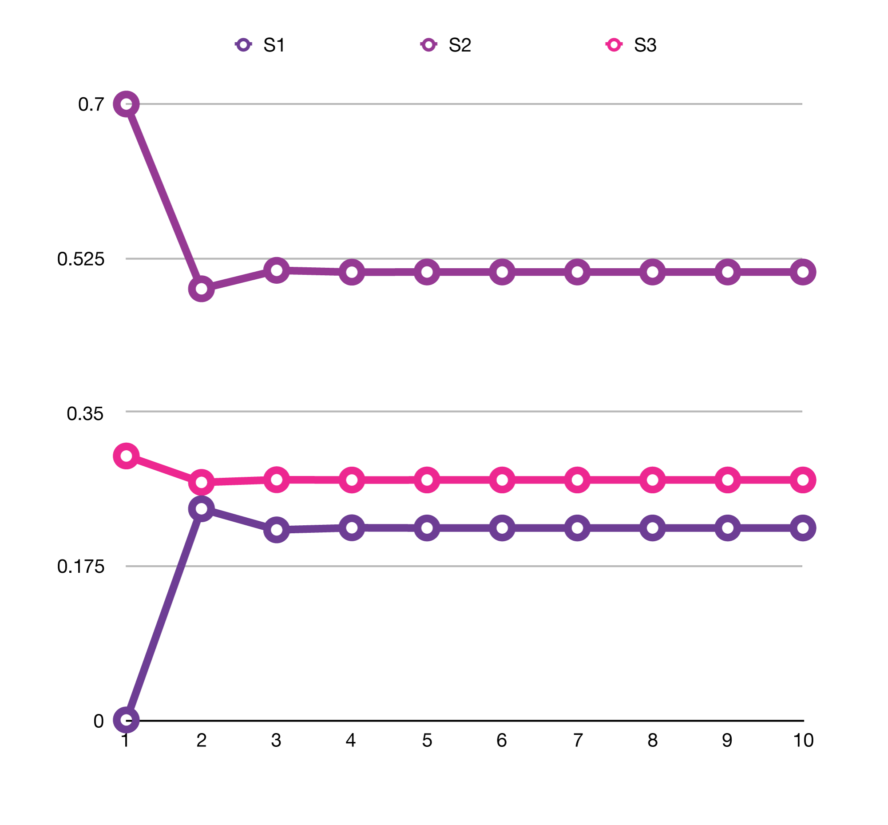
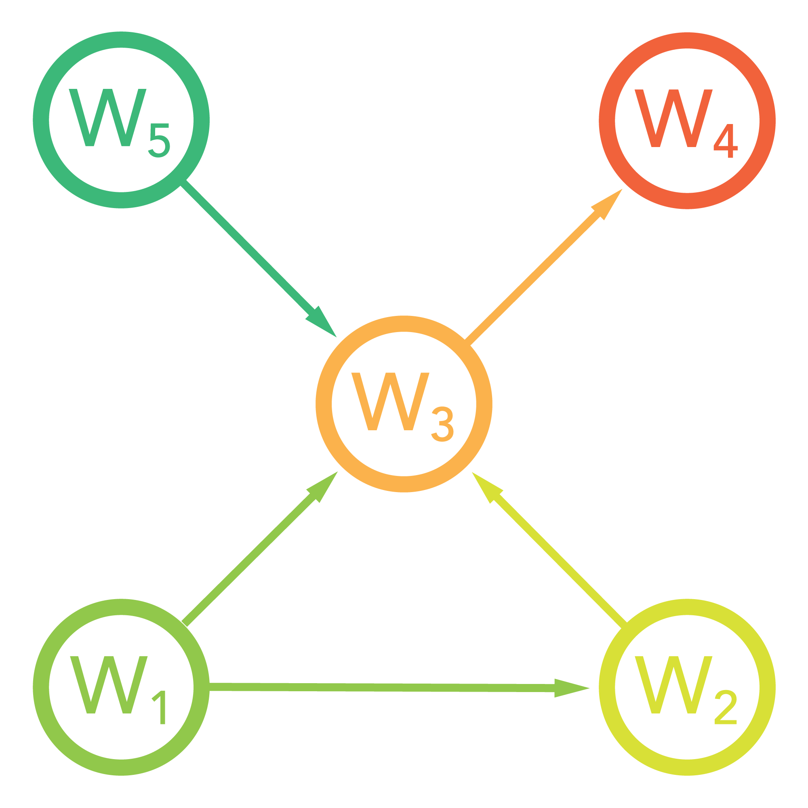
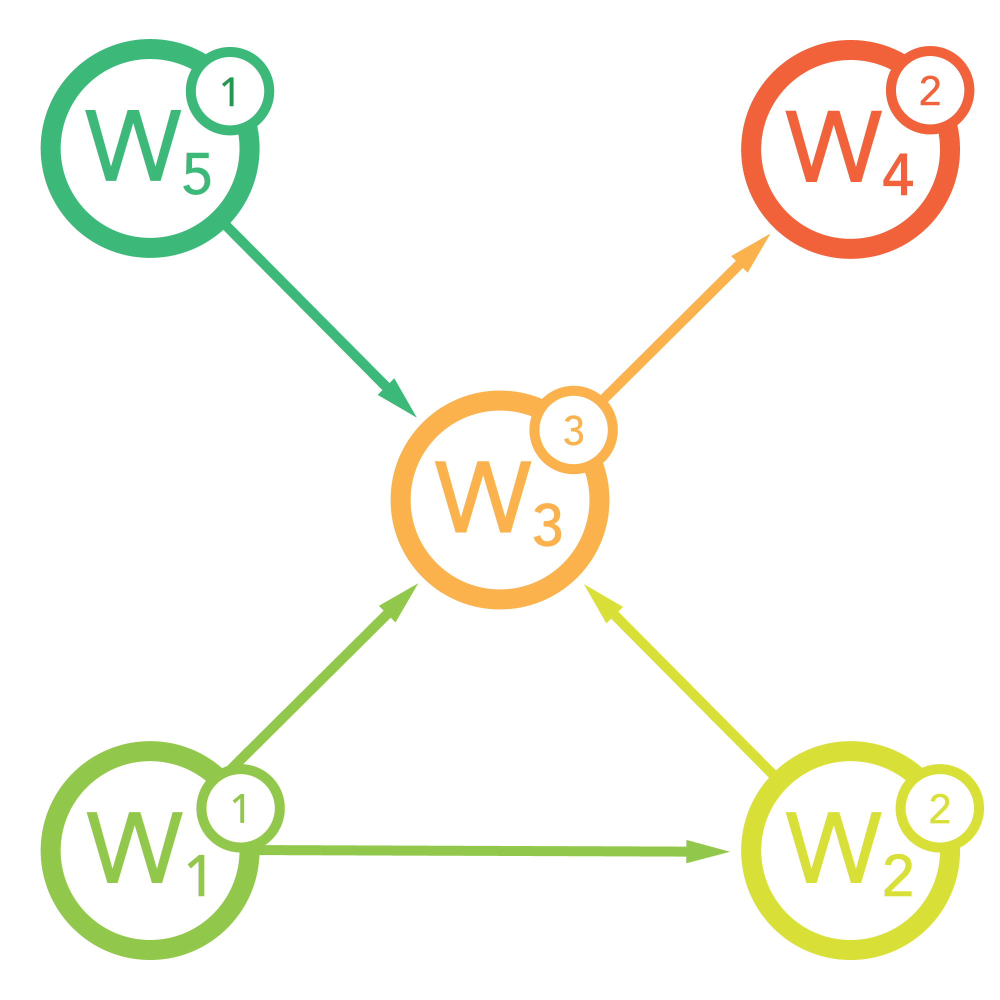

## Exercise 4: Page Rank Algorithm

### Introduction
One of the most vital concepts behind how Google ranks all the indexed websites is the so called «Page Rank Algorithm». 
First introduced and patented by Larry Page in 1998 [^1] this algorithm describes a method to assign a weight to every
page in the index depending on how many other pages link to that page and on the weight these pages have themselves.
In this article we'll cover the mechanics of the algorithm itself and some mathematical basics on which the algorithm relies on, such as the Markov-Chain and the Eigenvalue-problem.

### Eigenvalue and Eigenvectors
In order to better understand the mathematics behind, we need to cover a topic called «Eigenvalue/Eigenvector» first. 
Let's assume we have the following Matrix:

$$ 

A=\begin{bmatrix}1 & 2 \\ 3 & 4\end{bmatrix}

$$

Now, if we have a vector $$\vec{x}$$ which is not the null vector, then the following equation with the Eigenvalue 
represented by $$\lambda$$ must be valid:
  
$$

A\vec{x}=\lambda\vec{x}

$$

What is this good for? Well, imagine you have a square matrix of a million columns by a million rows – have fun 
multiplying this monster with a vector. The neat thing about Eigenvalues is that you can represent the whole Matrix with
just one scalar. And then do the multiplication with its corresponding Eigenvector instead. 

### The Markov-Chain
Equally essential to the understanding of the Page Rank Algorithm is the so-called «Markov-Chain». It describes a 
state-transformation matrix which holds the weights of an adjacency graph. And every weight represents the probability
with which the described system will change its current state to another. Let's have a look at the following image to
get a clearer picture:

{:width="40%"}

This diagram shows three stages $$ S_{1}, S_{2} $$ and $$ S_{3} $$. The weights of the graph show the probabilities of
every state to change into another. $$S_{2} $$ and $$S_{3}$$ can stay unchanged, whereas $$S_{1}$$ will always change
into another state. The outbound weigths of every state sum up to 1.

Now, if we were to represent this model, we can use a vector $$\vec{s}$$ to represent the probability in which state we
find ourselves at this very moment, and use an nxn matrix to represent the probabilities with which the current state 
will change into another. Let's assume that in the beginning, our system is in state $$S_{1}$$:

$$

\vec{s}(0) = \begin{bmatrix}1\\0\\0\end{bmatrix}, M=
\begin{bmatrix}
    0   & 0   & 0.8 \\ 
    0.7 & 0.7 & 0   \\
    0.3 & 0.3 & 0.2 \\
\end{bmatrix}

$$

As you can see, the columns of matrix $$M$$ represent the states $$S_{1}$$ to $$S_{3}$$ where we start at, and the rows represent the
states $$S_{1}$$ to $$S_{3}$$ where we want to go to. So, if we multiply our transformation matrix $$M$$ with our
initial state vector $$\vec{s}(0)$$, we'll get the following outcome:

$$

\vec{s}(1) = M \cdot \vec{s}(0) = \begin{bmatrix}
                                      0   & 0   & 0.8 \\ 
                                      0.7 & 0.7 & 0   \\
                                      0.3 & 0.3 & 0.2 \\
                                  \end{bmatrix} \cdot \begin{bmatrix}1\\0\\0\end{bmatrix} = 
                                  \begin{bmatrix}0\\0.7\\0.3\end{bmatrix}
                                  
$$

In other words: after one iteration (in practice, an iteration could represent one hour, one day or any other unit 
describing the interval of one state change), our system will be in state $$S_{2}$$ with a 70% chance, or in the state
 $$S_{3}$$ with a 30% chance.
 
How would be account for 3 iterations? Simple:

$$

\vec{s}(3) = M \cdot \vec{s}(0) = \begin{bmatrix}
                                      0   & 0   & 0.8 \\ 
                                      0.7 & 0.7 & 0   \\
                                      0.3 & 0.3 & 0.2 \\
                                  \end{bmatrix} \cdot (
                                  \begin{bmatrix}
                                      0   & 0   & 0.8 \\ 
                                      0.7 & 0.7 & 0   \\
                                      0.3 & 0.3 & 0.2 \\
                                  \end{bmatrix} \cdot (
                                  \begin{bmatrix}
                                      0   & 0   & 0.8 \\ 
                                      0.7 & 0.7 & 0   \\
                                      0.3 & 0.3 & 0.2 \\
                                  \end{bmatrix} \cdot \begin{bmatrix}1\\0\\0\end{bmatrix}
                                  )) = 
                                  \begin{bmatrix}0.216\\0.511\\0.273\end{bmatrix}
                                  
$$

After 3 iterations, we'll find ourselves in state $$S_{1}$$ with a 22% chance, in state $$S_{2}$$ with a 51% chance and
in state $$S_{3}$$ with a 27% chance. In a more general context we can write:

$$

\vec{s}(n) = M \cdot (M \cdot (... \cdot (M \cdot \vec{s}(0)))) = M^{n} \cdot \vec{s}(0)

$$

The interesting question now of course is: What happens if we continue the iterations eternally, i.e. how will the 
resulting state behave for $$n=\infty$$? The following diagram shows the results for various values for $$n$$:
 
{:width="80%"}

As you can easily see, the probabilities for the individual states converge to a value in which the system is «stable»
where it will stay, no matter how many more iterations will follow.

### Basic principle of the Page Rank Algorithm
Now that we have a basic understanding of the Markov-Matrix, let's dig into the mechanics of the Page Rank Algorithm.
Let's assume that we have five web pages $$W_{1}$$ to $$W_{5}$$ like so:

{:width="40%"}

Notice, that this describes a directed graph with the arrows representing hyperlinks to another web page. From this, we
can derive the following adjacency matrix:

$$
    M = 
\begin{array}{cc}
 
 & \begin{array}{ccccc} W_{1} & W_{2} & W_{3} & W_{4} & W_{5} \end{array} \\
 \begin{array}{c} W_{1} \\ W_{2} \\ W_{3} \\ W_{4} \\ W_{5} \end{array} &
  \left(\begin{array}{ccccc}
    0 & \quad 0 & \quad 0 & \quad 0 & \quad 0 \\
    1 & \quad 0 & \quad 0 & \quad 0 & \quad 0 \\
    1 & \quad 1 & \quad 0 & \quad 0 & \quad 1 \\
    0 & \quad 0 & \quad 1 & \quad 0 & \quad 0 \\
    0 & \quad 0 & \quad 0 & \quad 0 & \quad 0 
  \end{array}\right)
\end{array}
      
$$

The basic concept behind the algorithm is to let every web page give their votes for other pages by mentioning them in a
hyperlink. So, the more pages link to a specific page the higher this page gets weighed, i.e. «ranked». If we define that
every page has an initial weight of 1 and that every inbound link increases that weight by 1, then our diagram would
look the following.

{:width="40%"}

Currently, if we put this situation into an equation to calculate the weight of one specific page, we would get:

$$ w_{i} = \sum_{j=1}^{n} M_{ij} $$

However, this setup would be very easy to manipulate just by adding a ton of links to a page pointing to the web page 
for which you want to have a good rating. In order to eliminate this flaw, we give every page a total vote of 1 which 
it distributes evenly over all outbound links: 

$$ w_{i} = \sum_{j=1}^{n} \frac{M_{ij}}{n_{j}} $$

whereas $$n_{j}$$ represents the number of links on page $$j$$. So, on pages that have hunders of links (e.g. indexing
pages) a link to your page is literally «worth less» than a link from a page with only three links in total.

Still, one could create numberous individual pages with just one link and then point these pages to the page that should
get a lot of votes. In order to mitigate this risk, one further measure is added to the equation: the weight of the
issuing page itself:

$$ w_{i} = \sum_{j=1}^{n} \frac{M_{ij}}{n_{j}} w_{j} $$

Put into words, this means: The more votes a specific page has, i.e. the more popular a page is, the higher the value
of votes it gives to other pages.
Now, the formula above creates sort of a circular dependency because we are calculating the weight $$w_{i}$$ from 
another weight $$w_{j}$$. But how and when is the weight $$w_{j}$$ calculated? Well, from another weight. But ... where
does this chain start? It starts at every page having the initial weight of 1. Then, we use a Markov-Chain to develop
the weights iteration by iteration. It's as if we had a block of stone and we use sand paper to grind it down to a
sculpture. And the finished sculpture represents the «stable» state of our system.

Now, we know from the previous section that somewhere in eternety, our Markov-Chain will end up in this perfect 
equilibrium, where nothing has to be added or removed anymore and where the input state corresponds to the output state.
This is represented by the Eigenvalue-equation:

$$

A\vec{w}=\lambda\vec{w}

$$

If we were to calculate the corresponding Eigenvector (to Eigenvalue of 1) then we could just go ahead and resolve the
following system of linear equations:

$$

(A - \mathbb{I})\vec{w} = 0 
 
$$

But we must not forget that today, there are millions if not billions of web pages out there. Which means that we would
have to solve a system of that number of equations (which probably could be efficient with quantum computers...). So
 instead, we use the approximation by iteration we showed with the Markov-Chain:
 
$$

\vec{w}(n) = M^{n} \cdot \vec{w}(0)

$$

Let's go back to our initial adjacency matrix and execute that iteration to see what happens. First, we need to adapt 
the matrix to contain partial votes:

$$
    M = 
\begin{array}{cc}
 
 & \begin{array}{ccccc} W_{1} & W_{2} & W_{3} & W_{4} & W_{5} \end{array} \\
 \begin{array}{c} W_{1} \\ W_{2} \\ W_{3} \\ W_{4} \\ W_{5} \end{array} &
  \left(\begin{array}{ccccc}
    0 & \quad 0 & \quad 0 & \quad 0 & \quad 0 \\
    0.5 & \quad 0 & \quad 0 & \quad 0 & \quad 0 \\
    0.5 & \quad 1 & \quad 0 & \quad 0 & \quad 1 \\
    0 & \quad 0 & \quad 1 & \quad 0 & \quad 0 \\
    0 & \quad 0 & \quad 0 & \quad 0 & \quad 0 
  \end{array}\right)
\end{array}
      
$$

Our initial state vector $$\vec{w}(0)$$ is:

$$

\vec{w}(0) = \begin{bmatrix}
                1 \\ 1 \\ 1 \\ 1 \\ 1
             \end{bmatrix}
             
$$

After five iterations, our state looks like this:

$$

  \begin{bmatrix}
    0 &  0 &  0 &  0 &  0 \\
    0.5 &  0 &  0 &  0 &  0 \\
    0.5 &  1 &  0 &  0 &  1 \\
    0 &  0 &  1 &  0 &  0 \\
    0 &  0 &  0 &  0 &  0 
  \end{bmatrix}^{5} 
  \cdot \begin{bmatrix}
        1 \\ 1 \\ 1 \\ 1 \\ 1
        \end{bmatrix} = \begin{bmatrix}
                                0 \\ 0 \\ 0 \\ 0 \\ 0
                                \end{bmatrix} 
         
$$

Oh snap! Where did all our votes go?? Well, if you look at the diagram again you'll see that $$W_{4}$$ marks kind of
a dead end. If you follow the links you will eventually end up at $$W_{4}$$ and never get out of it again!  The 
same would happen if two nodes link to each other exclusively.

In order to overcome this «juice leak» we add the so-called «damping-factor» to the equation of one single iteration:
 
$$ w_{i} = \frac{1-d}{n} + d\cdot\sum_{j=1}^{n} \frac{M_{ij}}{n_{j}} w_{j}   $$

The damping-factor (usually 0.85) will decrease the weight of incoming links a little, but add a constant value of 
$$1-d$$ divided by the number of pages $$n$$ with every iteration. This will guarantee that there is always some source
of «base value» streaming into the system so that it doesn't dry out because of leaky pages.

This will lead to our final iteration formula:

$$

\vec{w}(k) = (1 - d) \cdot \sum_{j=0}^{k-1}d^{j}M^{j}\begin{bmatrix}1\\1\\1\\1\\1\end{bmatrix} + d^{k}M^{k}\vec{w}(0)

$$

With increasing $$k$$ the equilibrium i.e. the Eigenvector will be found at:

$$

\begin{bmatrix}0.15 \\ 0.21375 \\ 0.522938 \\ 0.594497 \\ 0.15 \end{bmatrix}

$$

This shows that our web page $$W_{4}$$ will be ranked highest (where all the votes end up) while $$W_{1}$$ and $$W_{5} 
will be ranked lowest (because they don't even have inbound links).


### Demonstrating the Page Rank Algorithm

Let's demonstrate the algorithm with a little Python program:

First, let's define a dictionary that holds the descriptions of our web pages:

```python
PAGES = {
    'funny-cat-pictures': {
        'links-to': (
            '
        )
    },
    'fakenews-of-the-day': {
        'links-to': (
        )
        
)
    
```

### Summary


### References
[^1]: https://www.google.com/patents/US6285999


<script type="text/javascript" async
  src="https://cdn.mathjax.org/mathjax/latest/MathJax.js?config=TeX-MML-AM_CHTML">
</script>