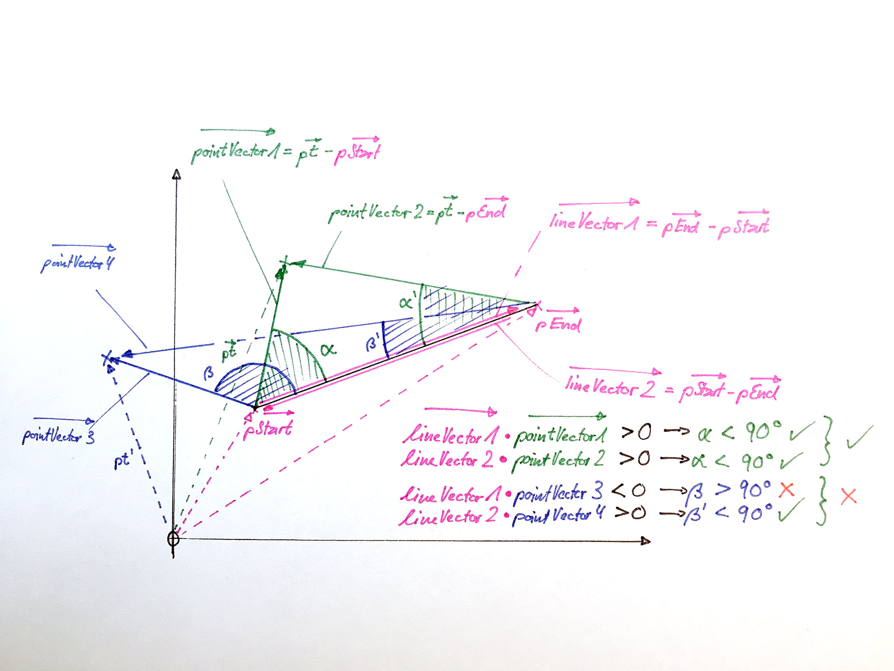
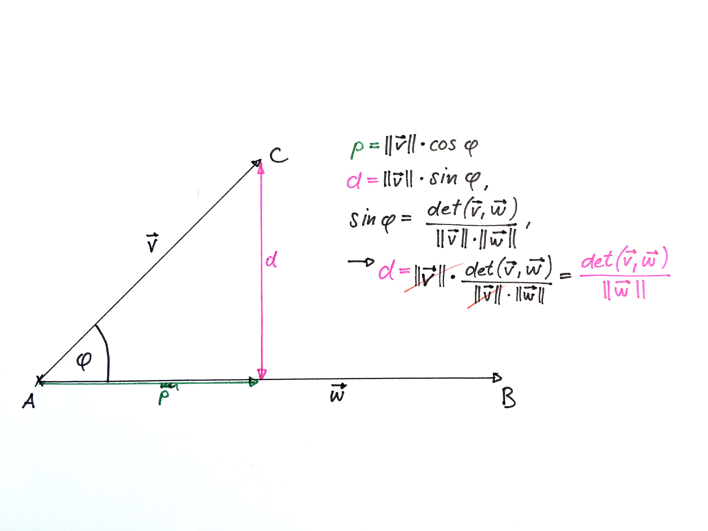

# LinAlg Exercises

## General notes on architecture

This is a JavaFX application which is split up into two major packages: The <strong>Application-Package</strong> and the <strong>Exercises-Package</strong>.

### Application-Package

This package contains the main entry point of the application (_class Main_). The _Main_ class loads the main window that will contain all exercises
in a TabPane so that each Tab represents and loads one exercise. The _ApplicationController_ class is assigned as controller to the application via the
_application.fxml_ user interface.

The _ApplicationController_ is responsible for loading the individual exercises dynamically into the tabs of the TabPane. After the main window has successfully
loaded, the _Main_ class calls the controller to initialize the tabs and load the first exercise.

All exercises must implement the _ifExercise_ interface.

### Exercises-Package

Since many of the exercises are going to use common components, it is a good idea to only implement them once and make them available to the exercises. Here's a short
description on the common parts:

#### ifCanvasDrawable interface

This interface must be implemented by all objects that need to be drawn on a JavaFX Canvas. Drawables will be iteratively called by the main render routine using the
_draw_ method and by passing a GraphicsContext reference. Thus, the actual process of drawing is delegated to the individual drawables themselves since they know
best how to do it. The only thing that is decided by the class rendering the scene is _where (which GraphicsContext)_ and _when_ the objects are drawn.

#### AbstractExercise class

Implements an exercise container in its very basic functionalities. All it does is storing a reference to the main exercise container (i.e. the Tab's contents) and
calling the _onExerciseInitialized_ hook.

#### AbstractCanvasExercise class

Basic implementation of a JavaFX-Canvas based exercise. This class extends the _AbstractExercise class_ and implements all steps required to set up a
JavaFX-Canvas element. A reference to the GraphicsContext of the Canvas is stored as _protected_ so that it is available to all subclasses.

#### Matrix class
This class represents a model of a matrix and provides methods to get and set values and to perform simple mathematical operations.
The dimensions of the matrix are set on initialization and are immutable. 

#### Vector2D class
As vectors are a specialized form of matrices, the Vector2D class inherits from the Matrix class. It implements methods for vector-specific operations
such as calculating its length (i.e. magnitude) and scalar product for example.

## Exercise 1: "Wohin klickt die Maus?"
The basic goal behind this exercise is to determine whether a given set of coordinates lie on a specific straight line segment or not, using linear algebra.

So, let's define the requirements for our program:
1. Provide a canvas for the user to draw straight line segments by dragging the mouse.
2. Listen to double-clicks and determine if the click was performed on a line segment. If this is the case, remove the line from the canvas.
3. This is an extra: Provide some UI-controls to set the line width and click tolerance (i.e. the size of the surrounding space to a line in which a click is still accepted as "being on the line").

Let's walk through some of the parts of the application. I will use an outside-in approach to explain how the application works:

### Setting up the exercise
Since this exercise is using JavaFX-Canvas, it inherits from the _AbstractCanvasExercise_ class. The exercise basically initializes the following way:

1. When the _onExerciseInitialized_ hook is called, build the additional GUI elements relevant to this exercise (req. 3). 
2. Then, create all necessary event listeners to provide the desired functionalities.

#### Listen for mouse actions
The _establishEventListeners()_ method creates all listeners that are required to register mouse clicks, drags and releases. Let's start with the __dragging__:

```java
container.addEventHandler(MouseEvent.MOUSE_DRAGGED, new EventHandler<MouseEvent>() {
    @Override
    public void handle(MouseEvent event) {
        if (isDragging) {
            currentLine.setEndCoordinates(event.getX(), event.getY());
            render();
        } else {
            isDragging = true;
            double x = event.getX();
            double y = event.getY();

            currentLine = new Line(x, y, x, y);
            currentLine.setThickness(thickness);
            drawables.add(currentLine);
        }
    }
});
```

We assign an anonymous EventHandler<MouseEvent> class to the MOUSE_DRAGGED event. Whenever a drag-event occurs (i.e.
left mouse button held down while moving the mouse) this class's _handle_ method is called. We differentiate between two
cases:
1. There have been draggin events prior to the current one and the _isDragging_ state variable is true. In this case we update the current line's end coordinates to the current mouse coordinates (i.e. moving the line's end along the mouse movement). Since the Canvas's contents have been updated, we need to call the _render_ method so that the Canvas is refreshed with the new material.
2. The current event is the first dragging event (_isDragging_ state variable is false). This means that the user has just started dragging and we have to create a fresh new line segment. We also set the line's thickness and then add it to the list of drawables.

Let's look at the __release__ event:
    
```java
container.addEventHandler(MouseEvent.MOUSE_RELEASED, new EventHandler<MouseEvent>() {
    @Override
    public void handle(MouseEvent event) {
        if (isDragging) {
            isDragging = false;
            currentLine = null;
        }
    }
});
```

This listener quite simply sets the _isDragging_ state variable to false if it had been dragging prior to the release event. It also removes the rerference to the current line. Notice that the line is still being referenced from the _drawables_ collection so it continues to be drawn by the _render_ routine.

The following listener is a little bit of an extra, too, but I think that it improves the user's experience:  

```java
container.addEventHandler(MouseEvent.MOUSE_MOVED, new EventHandler<MouseEvent>() {
    @Override
    public void handle(MouseEvent event) {
        if (!isDragging) {
            for (ifCanvasDrawable drawable: drawables) {
                if (drawable.isPointInside(new Vector2D(event.getX(), event.getY()))) {
                    drawable.setSelected(true);
                } else {
                    drawable.setSelected(false);
                }
            }
            render();
        }
    }
});
```

For every MOUSE_MOVED event that is not a dragging event, we iterate over all drawables and check if any of them has 
been 'hit' by the mouse by calling the _isPointInside_ method. If so, we set their state to 'selected'. 
This will give the user a visual cue on the object's interactivity.

Finally, let's look at how the lines can be deleted:

```java
container.addEventHandler(MouseEvent.MOUSE_CLICKED, new EventHandler<MouseEvent>() {
    @Override
    public void handle(MouseEvent event) {
        if (event.getClickCount() == 2) {
            for (ifCanvasDrawable drawable: drawables) {
                if (drawable.isPointInside(new Vector2D(event.getX(), event.getY()))) {
                    drawable.setDeleted(true);
                }
            }
            cleanScene();
            render();
        }
    }
});
```

For every double-click (_getClickCount()_ == 2) we check every drawable if it's coordinates match the ones of the current
mouse position. If so, we set their state to 'deleted'. After that, we call the _cleanScene_ method that deals with the
deleted objects. Separating the concerns of _marking objects as deleted_ and _actually dealing (i.e. deleting) with 
marked objects_ gives us two advantages:
1. We can omit the rather messy operation of manipulating a collection while it's being iterated over.
2. We are flexible to change the behaviour of deleting objects at any time without having to adapt the act of marking things for deletion at any time. We could acutally remove the objects from the collection, but we could also leave them or copy them to a separate 'deleted objects' collection so that they are potentially recoverable (i.e. their being deleted is "undoable").

Now that we've covered the major parts of the exercise, let's look under the hood and check out how the lines are handled.

### Drawing, deleting and interacting with line segments

In order to follow the object oriented path we use a Line model that handles all the business logic concerning line segments i.e. drawing, moving and 
checking if a given set of coordinates lies on the line segment. As mentioned earlier in the common section, every object
that we want to draw on Canvas must implement the ifCanvasDrawable interface. Let's start with how the line is drawn:

#### Drawing lines
Our _LineSegment_ model implements the _ifCanvasDrawable_ interface and thus the _draw_ method. The draw method is passed a
_GraphicsContext_ object that allows us to draw on a Canvas. So, all we have to do to draw a line instance is to set the line properties and then 
draw the line using JavaFX built-in functions:

```java
    @Override
    public void draw(GraphicsContext gc) {
        gc.setStroke(selected ? selectedColor : color);
        gc.setLineWidth(thickness);
        gc.strokeLine(
                pStart.getValue(0, 0),
                pStart.getValue(0, 1),
                pEnd.getValue(0, 0),
                pEnd.getValue(0, 1)
        );
    }
```

Next, let's check out how we can determine if a given set of coordinates lies on the line or not.

#### In the zone
Calculating whether a point lies on a line segment using linear algebra involves two steps:
1. If you draw a line to the given point from either end of the line segment, make sure that the angle between that new line and the line segment is smaller or equal to 90 degrees. If the point lies anywhere "behind" the line segment's end points, we can already say that this point does not lie on the line segment.
2. Calculate the distance between the point and the line. If the distance is within our declared tolerance, the point lies on the line.

Let's look at these two steps in detail:

##### 1. Determining angles
For this purpose we make use of some special properties of the __Scalar Product__ or __Dot Product__ (see: [Dot Product](https://en.wikipedia.org/wiki/Dot_product)) of two vectors:
- For any two vectors where the angle between them is __smaller than 90 degrees__, the Scalar Product will be __greater than 0__.
- For any two vectors where the angle between them is __greater than 90 degrees__, the Scalar Product will be __smaller than 0__.
- For any two vectors where the angle between them is __exactly 90 degrees__, the Scalar Product will be __0__.

Check out the following figure to get a visual idea of how this works:



In this example we have a line segment (pink) and we need to find out wheter either of the two points (green and blue) are within angle. In order to do so, we 
calculate the lineVectors and pointVectors by simple vector subtraction. Then, the Scalar Product between lineVector and pointVector gives us the answer: If the 
Scalar Product is greater than 0 for both ends of the line segment, this means that the point lies "between" the two ends of the line segment (green point). If this
is not the case, however, the Scalar Product is smaller than 0 for one of the ends (blue point).

Since we've already implemented basic matrix operations, this makes the calculation quite easy:

```java
private boolean isPointWithinAngle(Vector2D pt) {
    Vector2D lineVector1 = pEnd.difference(pStart);
    Vector2D lineVector2 = pStart.difference(pEnd);
    Vector2D pointVector1 = pt.difference(pStart);
    Vector2D pointVector2 = pt.difference(pEnd);

    return lineVector1.scalar(pointVector1) > 0 && lineVector2.scalar(pointVector2) > 0;
}
```

The return value of this method is __True__ if both Scalar Products are greater than 0 and thus the point lies between the two line segment ends. The only thing remaining now is to 
find out _how far_ the point is away from the line segment in order to tell if the point lies on the line segment or not:

##### 2. Distance between point and line
In order to calculate the distance between a given point and the straight line (which the line segment is part of), we could either use
trigonometric functions (Sine in particular) or we could also use the __determinant__ of two vectors.



For the sake of simplicity I will spare you the details of how to get from the Sine-form to the Determinant-form. As in the problem above, the
calculation of the determinan is already covered in our common _Vector2D_ class. And again, this makes the caluclation of the distance quite simple:
 
 ```java
 private boolean isPointInLine(Vector2D pt) {
     Vector2D lineVector = pEnd.difference(pStart);
     Vector2D pointVector = pt.difference(pStart);

     return Math.abs(pointVector.determinant(lineVector)) / lineVector.getLength() <= LineSegment.tolerance;
 }
 ```
 
 Since the value of the determinant could be positive or negative (point is "above" or "below" the line) and we're only interested in the _distance_ (i.e. magnitude), we
 use the _abs_ class-method of the _Math_ class. We also check the distance against our tolerance which is stored as class-variable on the LineSegment class.
 If the distance is within the tolerance, the method returns __True__, otherwise it returns __False__.
 
 
 #### Wrapping it up
 So, now that we know the two steps involved in determining if a point lies on a line segment, we just need to call both methods like so:
 
 ```java
public boolean isPointInside(Vector2D pt) {
    return isPointWithinAngle(pt) && isPointInLine(pt);
}
```

Notice that I chose the order of the method calls deliberately. If you compare the two methods, you will see that _isPointWithinAngle_ only uses additions whereas
_isPointInLine_ uses division. Since the CPU is much faster in calculating additions than divisions, it makes sense to call the less expensive method first.
The JVM (and many other interpreters and compilers) uses a concept called __"Short-Circuit Evaluation"__ which means that the evaluation in a statement with logical 
operators such as "&&" or "||" is aborted as soon as the overall result is known from the already evaluated components.

In our particular case this means that _isPointInLine_ (divisions) is only called if _isPointWithinAngle_ (additions) returns __True__. In every other case
we can safely say that the point __is not__ on the line segment and omit any further calculations involving division.
 


